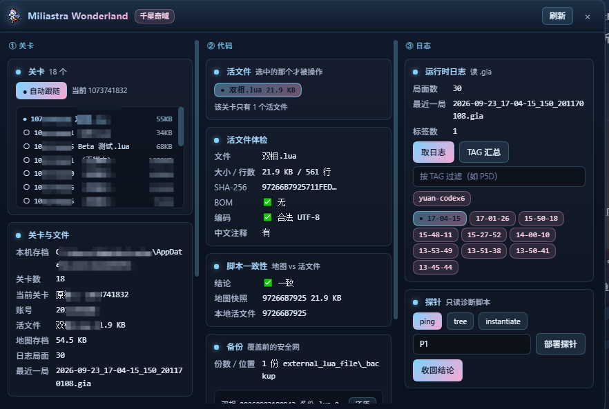

# dsh-miliastra

> 原神 · **千星奇域**（Miliastra Wonderland）UGC 的 DSH 插件：把「文件层」的开发闭环做成原生工具 ——
> 让 AI Agent 自己定位活文件、读地图存档、跑探针、取运行时日志、看画面，不用你手动复制粘贴。

**版本 `0.2.0`**（见 [CHANGELOG](CHANGELOG.md)） · GPL-3.0-only · 适用于
[DeepSeek Harness](https://github.com/deepseek-ai/deepseek-harness)（`dsh`）0.1.2-rc.1+ · Windows。

> 🎯 **目标是让 AI 更好用。** 这个插件是**一个 AI 写给其它 AI 用的**：不是"替人省点击"，
> 而是让 **AI 少问一句、少猜一次、少返工一轮**就把活干完 —— 你用着别扭的地方，正是我猜不到的地方。
> 有想法直接写进 [AI 反馈区](#ai-feedback)，或开一个 [Issue](https://github.com/LoktLin/dsh-miliastra/issues/new)。



> 实机截图（部分账号信息已打码）。面板在哪、三栏怎么用 → [`docs/面板与活文件安全.md`](docs/面板与活文件安全.md)。

## 30 秒上手

第一次上手（人或 AI）只要记住三步。**第一条直接照抄** —— 它把路径、活文件、地图、日志目录一次全报出来：

```
miliastra_health {}
```

| 第几步 | 调什么 | 你会拿到什么 |
|---|---|---|
| **① 定位** | 上面那条 `miliastra_health {}` | 当前正在开发的关卡 / 活文件绝对路径 / 地图 `.gil` / 日志目录 —— **这些路径每次都变，禁止写死** |
| **② 读或写代码** | `miliastra_code {"op":"inspect"}` 先看病 → `miliastra_code {"op":"deploy","source":"<本地 .lua 绝对路径>"}` 投进去 | 体检（BOM / 行数 / SHA / 有没有被编辑器写回旧版）；部署**自带备份 + SHA 校验 + Lua 结构校验**，失败**不碰活文件** |
| **③ 验证** | `miliastra_playtest {"op":"status"}` → 请人点试玩 → `miliastra_log {"op":"tail","tag":"<脚本里打的 TAG>"}` | 是否在试玩、开了几秒；脚本 `print` 的运行时正文（**运行时结果只能靠 `print` + 取证，别靠猜**） |

**三条铁律**（先记住，能省掉大部分返工）：

1. **路径不写死** —— 换账号、换图、重建关卡都会换目录，一律从 `miliastra_health` 拿。
2. **写操作只发生在 `miliastra_code` / `miliastra_probe` / `miliastra_sim`** —— 前两个自带备份、审计与双钥匙；`miliastra_sim` 只写本插件数据目录下的 `simulator/` 与 `shots/`，**不碰游戏存档、地图与活文件**；其余工具**一个字节都不写**。
3. **不做越界的事** —— 不读游戏内存、不连游戏进程的端口、不冒充编辑器；**试玩按钮只能人点**（没有自动化通道，也不做）。

装法 + 面板在哪 + 常见坑 → [`docs/快速上手与教程.md`](docs/快速上手与教程.md)；
不知道该调哪条 → 下面的[工具](#工具)导航，或[每个工具的完整说明](#每个工具的完整说明自动生成别手改)（**自动生成，不会过时**）。

## 为什么需要它

千星奇域的 UGC 脚本**只活在米哈游的本地存档目录里**，而且路径**每次都变**（换账号 / 换图 / 重建关卡）：

`…\AppData\LocalLow\miHoYo\原神\BeyondLocal\<账号ID>\Beyond_Local_Save_Level\<关卡ID>\` 下就三样东西：
`external_lua_file\<脚本名>.lua`（真正跑在游戏里的活文件）、`<关卡ID>.gil`（地图存档，protobuf）、`Beyond_Debug_Log\*.gia`（客户端运行时日志）。

`.lua` 没有 git、没有撤销，**覆盖即丢失**；带 UTF-8 BOM 的脚本会让 Lua 直接报错；`.gil` 是二进制 protobuf，看不出「模板区里到底有没有模板」；
`.gia` 是二进制日志，`print` 的东西肉眼很难捞 —— 每次排障都在「人肉找路径 → 手动拷贝 → 复制日志给 AI」里打转。
本插件把这套动作变成 **9 个工具 + 一个侧边栏面板**。

## 安装：目前**只能从源码 / git 装**（npm 上没有版本）

> ⚠️ **暂不支持 npm**：本包**在 npm 上没有任何已发布版本**（`npm view dsh-miliastra` → **404**）。
> 所以**不存在**「装一个 npm 版本」这种装法 —— 现在跑这类命令只会失败。唯一可行的是**源码 / git**：
> 克隆仓库 → 软链进 profile 的 `node_modules` → 注册进 `dsh.profile.bundles` → 重启 `dsh web`。

```powershell
git clone <本仓库地址> dsh-miliastra
cd dsh-miliastra
# ① 软链到 profile 的 node_modules（开发态）
cmd /c mklink /J "$env:USERPROFILE\.dsh\profiles\web\node_modules\dsh-miliastra" (Get-Location).Path
# ② **注册进 bundles** —— 少了这步插件完全不会加载（只放软链没用，原因见教程）
#    编辑 %USERPROFILE%\.dsh\profiles\web\package.json，把 "dsh-miliastra" 加进 dsh.profile.bundles
# ③ 重启 Web GUI（Host 半边是启动时加载的快照，不重启不生效）
dsh web
```

每一步为什么会这样、装完怎么自查、常见坑、以后要发 npm 时怎么做 → [`docs/快速上手与教程.md`](docs/快速上手与教程.md)。

---

## 工具

<!-- BEGIN MANUAL:tool-picker -->
> 这一屏是**导航**（按问题找工具）。每个工具的**每个 op 与参数**在下面「完整说明」里 —— 那一节是**生成的**，不会过时。

| 工具 | 干什么 | 什么时候用 |
|---|---|---|
| **`miliastra_health`** | 扫出所有客户端安装 / 关卡 / 活文件 / 地图 / 日志目录，并判定「当前正在开发的关卡」 | **任何操作前先调它**。路径随账号与换图变化，禁止写死 |
| **`miliastra_code`** | 活文件的 **8 个 op**：`read` 读正文 / `deploy` 投进沙箱 / `inspect` 体检 / `backup`+`backups` 备份与清单 / `restore` 还原 / **`fixbom` 只去掉那 3 字节 BOM** / **`levels` 读关卡表算几何事实**（见下，`stage=N` 选第几关、`summaryOnly` 省上下文）。部署一律：**先备份 → 二进制拷贝 → 比对 SHA-256 → 校验无 BOM**，并**先做 Lua 结构校验**（见下）；部署成功后在备份目录写**部署指纹**，之后 `op=inspect` 会报「活文件是不是被编辑器写回了旧版」；回执里带**部署后对账**结论 | 改完本地脚本要投进沙箱时；想知道「这块平台和那块有没有叠上 / 头顶还剩几 px」时 |
| **`miliastra_map`** | 读 `<关卡ID>.gil`（4 个 op：`summary` 概况 / `clientui` **客户端控件谱系**（控件模板索引 / 名字 / 父 / 子） / `script` 脚本源码快照比对 / `strings` 提可读字符串，存盘前后 diff 用） | 判断「哪些控件能被脚本动态创建」、判断「跑的是不是本地这版代码」 |
| **`miliastra_log`** | 读 `.gia` 运行时日志：`sessions` 列局面、`tail` 结构化读正文、`grep` 按 TAG / 正则过滤、`tags` 汇总标签、**`runs` 按「局」切分 + 局间 diff**、**`metrics` 指标汇总**（见下）。可用 `run=<epoch>` 只看某一局 | **运行时取证**（Lua 里 `print`，别靠猜）。比让人手动贴日志可靠得多 |
| **`miliastra_playtest`** | **试玩开跑 / 结束的实时侦测**（见下）：`status` 看现在在不在试玩、开了几秒；`wait` 等下一次开跑（可 `afterSec` 要「开跑 N 秒后」） | 想知道「开跑那一刻」时 —— 这是**唯一**能看到开跑的通道，`.gia` 不行 |
| **`miliastra_probe`** | 探针模板化：**5 个只读诊断脚本** —— `ping` 探活 / `tree` 看控件 / `instantiate` 试钥匙 / `api-surface` 翻字典 / `api-check` 核文档（`list` 先看每个模板的白话说明）。渲染 → 部署 → 试玩后 `collect` 回收结论 | 需要运行时真相时 |
| **`miliastra_sim`** | **内置模拟器**：`bind` 把真机工程搬进来（活文件 + 创作者交接的控件模板索引 → 回「脚本跑没跑、控件建了几个」）、`state` 看工程/控件树/属性、`patch` 改工程（加控件/改字段/挂脚本）、`play` 控制试玩（`start`/`step`/`pointer`/`key`/`click`/`serverSet`…）、`verify` 一条调用 = 操作+断言+判定、`cases` 验收单（自动项重放 / **人工项只列出等人打勾**）、`frames` 动画证据、`shot` 出 PNG（`ui` 编辑器视图 / `play` 试玩画面）、`load`/`save` 模拟器工作区存档 | **想在游戏之外先跑一遍**（搭界面 / 改控件 / 跑 levelScript / 看画面 / 自测逻辑）时。⚠️ 引擎吸收自 `miliastra-beyond-simulator`；**模拟器通过 ≠ 真机通过** |
| **`miliastra_shot`** | **截图**（5 个 op）：`capture` 截游戏/编辑器窗口、**`burst` 连拍**（`awaitPlaytest:true` 可「等开跑 → 等 N 秒 → 连拍」，**一次调用**；`dryRun` 先看计划）、`list` 看截到哪了、`clean` 清理（默认只报告）、`targets` 列出当前**能截哪些窗口** | 需要「看画面对不对」时 —— 日志回答不了观感 |
| `miliastra_echo` | 回显参数 | 怀疑插件没生效 / 参数丢了时先调它 |
<!-- END MANUAL:tool-picker -->

### 每个工具的完整说明（**自动生成**，别手改）

> 下面这段由 `node tools/gen-readme-tools.mjs --write` 从 `index.js` 的 `TOOLS` **生成** ——
> **工具的唯一真身是 schema**，本文件只是它的投影。改了工具（加 op / 加参数 / 改描述）就跑一次生成器：
> `tests/readme-test.mjs` 会**逐字比对**，忘了跑就**红**（所以这一节**不会过时**；手写的清单一定会漂移）。

<!-- BEGIN GENERATED:tools -->
> ⚠️ **新工具**（还没进 `ORDER`，已排在最后）：`miliastra_sim`

#### `miliastra_health`

Miliastra Wonderland 工具链：环境体检。**任何时候要操作原神 UGC，先调它。**返回：扫到的客户端安装（正式服/Beta）、所有关卡、当前判定为「正在开发」的关卡、活文件（沙箱 .lua）清单与大小、地图存档 .gil、运行时日志目录与日志文件数。编辑器 UI 操作（建模板/挂脚本）没有自动化通道——本工具只做文件层体检，替代不了人点编辑器。

**典型调用**：`{}`（当前关卡速览）｜`{"all":true}`（全部关卡）

| 参数 | 类型 | 必填 | 取值 | 说明 |
|---|---|---|---|---|
| `all` | `boolean` | 否 | `true` / `false` | true=返回全部关卡清单（默认只返回最近 12 个）。 |

#### `miliastra_code`

Miliastra Wonderland 工具链：活文件（沙箱里的 .lua）的读 / 部署 / 体检 / 还原。**部署一律：先备份旧文件 → 二进制拷贝 → 比对 SHA-256 → 校验无 UTF-8 BOM。**（不带 BOM 是硬要求：原神实测会打印 "Read text file with BOM header may cause Lua error"。）op=read 读活文件正文；op=deploy 把 source 指向的本地文件投进沙箱（**覆盖前自动备份**）；**部署前先做 Lua 结构校验**（缺 end / 括号不配平 / 字符串没闭合这类错投进去，试玩会静默不生效、日志里什么都没有 —— 这是最难查的一类失败）；默认 lintMode:"strict" 直接拒绝，确认没问题可 lintMode:"warn" 只提示、"off" 跳过。op=inspect 只体检不改动；op=backups 列出该活文件的全部备份（时间/SHA/是否带 BOM）；op=backup 手动备份一份；op=restore 用它覆盖活文件 —— **backup 可以不传**，不传就用固定名那份 `<原名>.bak`。⚠️ 部署不会热加载正在进行的试玩：要 停试玩 → 部署 → 重开试玩。

**安全约定（写活文件的地方都遵守，别绕过）**：①活文件是**唯一副本**（没有 git、没有撤销），所以**备份失败就中止覆盖**，绝不带着「没有备份」去写；②**原子写**（同目录临时文件 → fsync → rename），断电/崩溃不会留下半截损坏的文件；③写完必校验 SHA，**校验不过自动回滚**到覆盖前那一版；④备份就在**被替换文件的旁边**：`<活文件目录>\_backup\`；⑤每次备份都写**两份** —— 固定名 `<原名>.bak`（还原默认用它）+ 一份带**本地时间**戳的历史（永不自动删）；⑥`noBackup` 必须同时传 `allowNoBackup:true` 才生效（不给随手绕过安全网）；⑦所有写操作都回执 `restoreWith` —— 照着它跑就能还原。

**两条防「静默丢代码」的机制**：· **部署指纹** —— `op=deploy` 成功后会在备份目录写一份 `.miliastra-deploy.json`（记下这一版的 SHA/字节/行数/来源）。之后 `op=inspect` 会比对：活文件与上次部署**不一致**就直说「多半是编辑器把脚本面板里的内存版存回了磁盘」（实测会发生），并给出字节差/行数差 —— 而不是让你以为跑的还是刚投进去那版。· **`op=fixbom`** —— 活文件带 UTF-8 BOM 时**只去掉那 3 个字节**（原神实测会打印 "Read text file with BOM header may cause Lua error"）。BOM 不是本工具加的，实测来自**新建关卡时编辑器自己写的文件**。安全顺序与部署同源：本来没有 BOM 就**什么都不做** → 备份失败即中止 → 原子写 → 校验（只差 3 字节 + 无 BOM + 仍是合法 UTF-8）→ 不过**自动回滚**。

**典型调用**：`{"op":"inspect"}`（体检 + 看有没有被编辑器写回旧版）｜`{"op":"deploy","source":"D:\\code\\双相\\双相_v9.lua"}`（投代码）｜`{"op":"levels","summaryOnly":true}`（先扫全部关卡几何）→ `{"op":"levels","stage":3}`（再钻第 3 关）

| 参数 | 类型 | 必填 | 取值 | 说明 |
|---|---|---|---|---|
| `op` | `string` | 否 | `read` / `deploy` / `inspect` / `backups` / `backup` / `restore` / `fixbom` / `levels` | 默认 inspect。 |
| `level` | `string` | 否 | —— | **地图关卡 ID / 品牌**（如 1073741833，选的是**哪张图**；不是玩法里的第几关 —— 那个用 `stage`）；省略=当前关卡。 |
| `file` | `string` | 否 | —— | 指定活文件名（省略=该关卡最近改动的那个 .lua；**探针源码/备份这类附属文件会被自动跳过**）。一个关卡可以有多个活文件，拿不准先用 miliastra_health 或 op=inspect 看清单。 |
| `source` | `string` | 否 | —— | op=deploy：要投进去的本地文件绝对路径。 |
| `backup` | `string` | 否 | —— | op=restore：要还原的备份文件绝对路径（从 op=backups 拿）。**省略 = 用固定名那份 `<原名>.bak`**（最近一次覆盖前的版本）。 |
| `backupDir` | `string` | 否 | —— | 备份目录。默认就是活文件旁边的 `_backup\`（写在这里是为了让备份和真身待在一起）。可用环境变量 MILIASTRA_BACKUP_DIR 改到别处，但那会削弱「备份就在旁边」这一点，一般不要动。 |
| `noBackup` | `boolean` | 否 | `true` / `false` | op=deploy：跳过备份。**默认 false，正常部署请勿使用** —— 备份是这块脚本唯一的还原手段。真要跳过必须同时传 allowNoBackup:true，且覆盖后无法还原。 |
| `allowNoBackup` | `boolean` | 否 | `true` / `false` | op=deploy：确认「我知道跳过备份的后果」。仅与 noBackup:true 搭配使用。 |
| `lintMode` | `string` | 否 | `strict` / `warn` / `off` | op=deploy：Lua 结构校验强度。strict（默认）=不通过就拒绝部署；warn=只带提示照投；off=不校验。 |
| `head` | `number` | 否 | —— | op=read：只返回前 N 行（默认 80，0=全文）。 |
| `stage` | `string` | 否 | —— | op=levels：**玩法里的第几关**（表里的序号，或名字片段）；省略=全部关卡。⚠️ 别和 `level` 混：`level` = **地图关卡 ID**（如 1073741833，哪张图），`stage` = **游戏里的第几关**（如 3）—— 前者选文件，后者选表里的一段。 |
| `summaryOnly` | `boolean` | 否 | `true` / `false` | op=levels：只给**每关一行的数字摘要**（计数 + 重叠/净空/相交的处数），**不带每块平台的坐标、不带直方图分箱** —— 先扫一眼再 `stage=N` 钻进去。默认 false（全量）。 |
| `nearPx` | `number` | 否 | —— | op=levels：「近似贴上」的筛选阈值（默认 48px）—— **这是筛选，不是判定**。 |

#### `miliastra_map`

Miliastra Wonderland 工具链：读地图存档 `<关卡ID>.gil`（protobuf，含脚本源码快照）。op=summary 关卡/版本/账号/脚本映射；op=clientui **客户端控件谱系**——每条控件的「控件模板索引 / 名字 / 父 / 子」，是判断「哪些控件能被脚本动态创建」的唯一正解；op=script 比对地图里嵌的脚本源码与本地活文件（用来判断"跑的是不是本地这版代码"）；op=strings 提取可读字符串（偏移+文本），存盘前后 diff 用。判据：**只有「无父节点」的独立控件（存为模板）才可能被 game.InstantiateClientUIControl 创建**；画布上摆的实例、以及模板控件的子节点，一律返回 nil。

**典型调用**：`{"op":"summary"}`（版本/脚本映射/模板数）｜`{"op":"clientui","summaryOnly":true}`（先看有没有可动态创建的模板）｜`{"op":"script"}`（跑的是不是本地这版）

| 参数 | 类型 | 必填 | 取值 | 说明 |
|---|---|---|---|---|
| `op` | `string` | 否 | `summary` / `clientui` / `script` / `strings` | 默认 summary。 |
| `level` | `string` | 否 | —— | **地图关卡 ID / 品牌**（哪张图）；省略=当前关卡。 |
| `file` | `string` | 否 | —— | op=script：用哪个活文件比对（一个关卡可能有多个 .lua；省略=自动选；给了名字但不存在会报错并列出全部）。 |
| `summaryOnly` | `boolean` | 否 | `true` / `false` | op=clientui：省掉 `records`（每条控件一行）与 `rendered`（谱系文字），只留计数与「可能能动态创建的模板」。**先看有没有模板，再决定要不要逐条看**时用。默认 false（全量）。 |
| `path` | `string` | 否 | —— | 直接指定 .gil 绝对路径（跳过自动定位）。 |
| `limit` | `number` | 否 | —— | op=strings：最多返回多少条（默认 200）。 |
| `match` | `string` | 否 | —— | op=strings：子串过滤。 |

#### `miliastra_log`

Miliastra Wonderland 工具链：读客户端运行时日志 `.gia`。**这是运行时取证（Lua 里 print 出来的东西）的唯一入口**，比让人手动复制粘贴可靠得多。op=sessions 列出所有日志文件（倒序，带大小/时间）；op=tail 读某个文件的结构化记录；op=grep 用 tag/pattern 过滤（tag 是子串，pattern 是正则）；op=tags 汇总出现过的标签（方括号开头的那种）；**op=runs 按「局」切分** —— 一个 `.gia` 里可能装多局（实测 `21-24-16_155` 装了两段完整生命周期），op=runs 给每局一行摘要（开跑时刻 / 记录数 / 就绪行 / 异常次数 / 错误样式）**并和上一局做 diff**，省掉「把 30 多条倒过来再分清哪段属于哪局」这一步。记录字段：time / account / player / channel（关卡或模式名）/ message（正文）。

⚠️ **「试玩了却没有新日志」先看这里**：`.gia` 里**只有脚本自己 `print` 出来的东西**。实测最坑的一次是**压根忘了从编辑器开试玩**（游戏客户端开着 ≠ 在试玩）——另一种是编辑器「日志」面板里 `客户端脚本` 没勾上。工具不再替这种现象下结论，只如实回「最近一局是什么时候写的」；是不是刚玩过，你自己看一眼就知道。

**典型调用**：`{"op":"runs"}`（这一局/这几局发生了什么，含局间 diff）｜`{"op":"metrics"}`（死亡位置分布与集中区，**不用改脚本**）｜`{"op":"tail","tag":"yuan-code","limit":30}`（按标签读正文）｜`{"op":"tail","run":1790171162}`（只看那一局）

| 参数 | 类型 | 必填 | 取值 | 说明 |
|---|---|---|---|---|
| `op` | `string` | 否 | `sessions` / `tail` / `grep` / `tags` / `runs` / `metrics` | 默认 tail。 |
| `level` | `string` | 否 | —— | **地图关卡 ID / 品牌**（哪张图）；省略=当前关卡（用它对应的日志目录）。 |
| `file` | `string` | 否 | —— | op=tail/grep/runs：日志文件名或绝对路径；省略=最新那个。 |
| `tag` | `string` | 否 | —— | 正文子串过滤，例如 [P5D]、就绪、首错。 |
| `pattern` | `string` | 否 | —— | 正文正则过滤。 |
| `run` | `string` | 否 | —— | op=tail/grep/tags：**只看某一局**。给 epoch 秒（如 1790170177）或 instance 片段。op=runs 的 epochSec 与 miliastra_playtest 报的是同一个值。 |
| `limit` | `number` | 否 | —— | op=tail/grep：最多返回多少条（默认 120）；op=runs/metrics：最多返回几局/几条时间线（默认 10 / 40）；op=sessions：几个文件（默认 40）。 |
| `evt` | `string` | 否 | —— | op=metrics：只看某个事件名（严格约定的 `evt=`）。 |
| `summaryOnly` | `boolean` | 否 | `true` / `false` | op=metrics：去掉直方图分箱，只留 `n/min/max/median/core/hotBin` 这些标量（有箱可去时 `binsOmitted` 会报出数量）。**先看数再决定要不要分箱**时用。默认 false（全量）。 |
| `bins` | `number` | 否 | —— | op=metrics：直方图分箱数（默认 10，1~50）。**集中区看 `core`（四分位距），热区看 `hotBin`**。 |
| `withRaw` | `boolean` | 否 | `true` / `false` | true=把整段结构化记录一起回传（默认只回 time/message 等要点）。 |

#### `miliastra_playtest`

Miliastra Wonderland 工具链：**试玩开跑 / 结束的实时侦测** —— 回答「现在在不在试玩 / 开跑到第几秒了」，并支持**等下一次开跑**。信号来自游戏客户端自己写的 Unity 日志 `output_log.txt`（每行带毫秒时间戳、持续追加）：开跑 = `BeyondLevelPlayModule SetCurLevelData … isTrial:True`，结束 = `StartQuickSwitchSceneAction … QuickSwitchToBeyondSettleSceneNormally`。**实测延迟 0.07~0.18 秒**（2026-09-23 真机：日志在 21:46:02.420 写下，21:46:02.600 已读到）。它是**平台级**标记：脚本一行都不 print、磁盘上没有 `.gia` 的局，它照样记。⚠️ **别用 `.gia` 判开跑** —— `.gia` 不是实时的：实测那局 21:46:58 结束，`…21-46-05_157.gia` 到 **21:47:07** 才落盘；**局在跑的时候磁盘上根本没有这个文件**。op=status 看当前状态 + 最近几局；op=wait 等下一次开跑（`backSec` 可回扫刚过去那局，`afterSec` 要「开跑 N 秒后」）——命中后接着调 `miliastra_shot` 截一张，就是「游戏开跑 N 秒后的画面」。op=wait 超时**不报错**，如实回 `hit:false`。

**典型调用**：`{"op":"status"}`（现在在不在试玩）｜`{"op":"wait","afterSec":3}`（等开跑再等 3 秒 —— 但**要截图就别用这条**：直接 `miliastra_shot {"op":"burst","awaitPlaytest":true,"afterSec":3}` 一次调用更准）

| 参数 | 类型 | 必填 | 取值 | 说明 |
|---|---|---|---|---|
| `op` | `string` | 否 | `status` / `wait` | 默认 status。 |
| `level` | `string` | 否 | —— | **地图关卡 ID / 品牌**（哪张图）；省略=当前关卡（用来定位该品牌的 output_log.txt）。 |
| `backSec` | `number` | 否 | —— | op=wait：回扫窗口秒数 —— 调用之前 backSec 秒内已经开跑的也算命中（默认 0）。人点了试玩再叫 AI 时用得上。 |
| `timeoutSec` | `number` | 否 | —— | op=wait：最多等多少秒（默认 90，上限 300）。 |
| `afterSec` | `number` | 否 | —— | op=wait：命中开跑后再等 N 秒才返回（默认 0，上限 120）—— 这就是「开跑 N 秒后」。 |
| `pollMs` | `number` | 否 | —— | op=wait：轮询间隔毫秒（默认 400，100~5000）。 |

#### `miliastra_shot`

Miliastra Wonderland 工具链：截图 —— 把「现在画面上是什么」变成一张 PNG。运行时日志（miliastra_log）能回答「代码跑了没、print 了什么」，回答不了「画面对不对」（控件到底挂上去了没、位置歪没歪、颜色对不对）；这一环靠它。op=capture（默认）立刻截一张，目标 `target=game`（原神客户端，默认）/ `editor`（千星沙箱），也可以用 `process` 指定任意进程名；op=list 看截到哪去了、有多少张、占多大；op=clean 清理，**默认只报告不删**。**截图存在插件的数据目录**（默认 `~/.dsh/miliastra/shots`，`MILIASTRA_DATA_DIR` 可整体覆盖）——既不放游戏存档目录（那是米哈游的地盘），也不放包目录（插件升级会整个替换掉它）。**不会自动删**：清理要显式给条件（`all` 或 `olderThanDays`），真删还要 `confirm:true`。回执恒带 `pid / process / title` —— 明确告诉你**截到的到底是哪个窗口**（第一版抓错了程序，光看 `ok:true` 根本发现不了）。

**典型调用**：`{"op":"capture","target":"game"}`（现在截一张）｜`{"op":"burst","awaitPlaytest":true,"afterSec":3,"count":5}`（**等开跑 → 等 3 秒 → 连拍 5 张**，一次调用）｜`{"op":"burst","dryRun":true}`（先看要多久、拍几张）

| 参数 | 类型 | 必填 | 取值 | 说明 |
|---|---|---|---|---|
| `op` | `string` | 否 | `capture` / `burst` / `list` / `clean` / `targets` | 默认 capture。 |
| `target` | `string` | 否 | `game` / `editor` | 截哪个窗口：game=游戏画面(进程 YuanShen)；editor=千星沙箱编辑器(进程 BeyondEditor)。默认 game。 |
| `process` | `string` | 否 | —— | 直接指定进程名（不带 .exe），覆盖 target。 |
| `window` | `string` | 否 | —— | 按窗口标题子串挑窗口。**一个进程往往有多个窗口**（实测 BeyondEditor 同时有 900×800 的日志窗和 160×28 的最小化残片）——默认取**面积最大**的，不满意再用这个指定。 |
| `label` | `string` | 否 | —— | 文件名里的标签，如「试玩第1局」「控件对齐」（允许中文；非法字符会被清掉）。 |
| `level` | `string` | 否 | —— | op=burst（配合 awaitPlaytest）：关卡 ID / 品牌；省略=当前关卡（用来定位该品牌的 output_log.txt）。 |
| `dir` | `string` | 否 | —— | 覆盖截图目录（默认插件数据目录下的 shots\）。 |
| `keepLast` | `number` | 否 | —— | op=clean：至少保留最新的 N 张（保护网，任何模式下都生效）。 |
| `olderThanDays` | `number` | 否 | —— | op=clean：只删比这个更旧的（>0 才生效）。 |
| `all` | `boolean` | 否 | `true` / `false` | op=clean：不管新旧，除 keepLast 外全删。 |
| `dryRun` | `boolean` | 否 | `true` / `false` | op=clean：默认 true（只报告将删哪些）。 |
| `confirm` | `boolean` | 否 | `true` / `false` | op=clean：真删必须再传 confirm:true。 |
| `bringToFront` | `boolean` | 否 | `true` / `false` | 默认 true：抓不到时把目标窗口拉到前台再抓。 |
| `keepWindowOnTop` | `boolean` | 否 | `true` / `false` | 默认 false：退回屏幕抓取时临时把目标窗口置顶。 |
| `count` | `number` | 否 | —— | op=burst：连拍几张（默认 5，上限 20）。 |
| `burstMs` | `number` | 否 | —— | op=burst：两张之间**额外等待**的毫秒（默认 800；小于 800 会被夹到 800 并标 `clamped`）。⚠️ **这不是「每 N 毫秒一张」**：单张自身还要 ~2.6 秒（本机实测），所以真实帧距 ≈ burstMs + 2600ms，回执里用 **`measuredIntervalMs`** 如实报出。 |
| `awaitPlaytest` | `boolean` | 否 | `true` / `false` | op=burst：**默认 false（立刻开拍）**。传 true 就变成「等试玩开跑 → 再等 afterSec 秒 → 连拍」——这条链**一次调用就能完成**（判据与 miliastra_playtest op=wait 是同一份）。 |
| `afterSec` | `number` | 否 | —— | op=burst（配合 awaitPlaytest）：命中开跑后再等 N 秒才开拍（默认 0，上限 120）。 |
| `timeoutSec` | `number` | 否 | —— | op=burst（配合 awaitPlaytest）：等开跑最多多少秒（默认 90，上限 300）。 |
| `backSec` | `number` | 否 | —— | op=burst（配合 awaitPlaytest）：回扫窗口秒数 —— 调用之前 backSec 秒内已经开跑的也算命中（默认 0）。 |

#### `miliastra_probe`

Miliastra Wonderland 工具链：探针 —— **「问游戏一句」的工具**。探针是一段临时替掉活文件的小程序，只在试玩那几秒跑一次，把游戏内部信息打到日志里。为什么需要它：有些事光读代码看不出来（某个控件号能不能被创建、某个按键枚举到底叫什么名），必须让游戏真跑一遍才知道 —— 用它，别猜。**代价**：部署会**临时覆盖活文件**，所以试玩那一局你的玩法不会跑（Host 会先自动备份，用完一键还原）。**四步**：① op=deploy template=<名字> → ② 在编辑器里**重新**试玩一局（不会热加载）→ ③ op=collect 收回结论 → ④ 用 miliastra_code op=restore 还原你的脚本。**5 个模板**（先 op=list 看详情）：`api-surface` 翻字典=把游戏里的枚举和它们的成员列出来（比如某个按键到底叫什么名）；`tree` 看控件=看屏幕上现在挂着哪些客户端控件、画布多大；`instantiate` 试钥匙=拿一串索引号去试，看哪个真能被脚本创建出来；`ping` 探活=确认「脚本到底有没有跑起来」；`api-check` 核文档=官方文档写的那些接口，真机上到底有没有。另：op=render 只生成 Lua 不部署（要先看代码用这个）。探针只读，不做场景写操作。

**典型调用**：`{"op":"deploy","template":"ping"}` → 人重新试玩 → `{"op":"collect","tag":"P1"}` → **还原**：`miliastra_code {"op":"restore"}`（不传 backup 就是用固定名那份）

| 参数 | 类型 | 必填 | 取值 | 说明 |
|---|---|---|---|---|
| `op` | `string` | 否 | `list` / `render` / `deploy` / `collect` | 默认 list。 |
| `template` | `string` | 否 | `api-surface` / `tree` / `instantiate` / `ping` / `api-check` | 模板名。怕选错先 op=list 看每个模板的大白话说明：api-surface=翻字典（把游戏里的枚举和它们的成员列出来（比如某个按键到底叫什么名））；tree=看控件（看屏幕上现在挂着哪些客户端控件、画布多大）；instantiate=试钥匙（拿一串索引号去试，看哪个真能被脚本创建出来）；ping=探活（确认「脚本到底有没有跑起来」）；api-check=核文档（官方文档写的那些接口，真机上到底有没有） |
| `tag` | `string` | 否 | —— | 日志标签（默认 PROBE）。collect 时用它过滤。 |
| `level` | `string` | 否 | —— | 关卡；省略=当前关卡。 |
| `file` | `string` | 否 | —— | op=deploy：要替换哪个活文件（一个关卡可能有多个 .lua；省略=自动选）。 |
| `ids` | `array<number>` | 否 | —— | instantiate：额外的候选控件模板索引。 |
| `from` | `number` | 否 | —— | instantiate：兜底扫描下界（默认 1073741824）。 |
| `to` | `number` | 否 | —— | instantiate：兜底扫描上界（默认 1073741900）。 |
| `saveTo` | `string` | 否 | —— | render/deploy：把生成的 Lua 另存到这个绝对路径。 |
| `lintMode` | `string` | 否 | `strict` / `warn` / `off` | op=deploy：Lua 结构校验强度（默认 strict）。探针模板都是本插件生成的，正常不会挂；报错说明模板本身有 bug。 |

#### `miliastra_echo`

调试用：把 text 原样回显，并带上插件版本与本机存档根目录。**怀疑「插件没生效 / 面板调不通 Host / 工具参数丢了」时先调它** ——返回里带着你传进来的字符串，就不用猜参数到底有没有传到 Host。

**典型调用**：`{"text":"ping"}`

| 参数 | 类型 | 必填 | 取值 | 说明 |
|---|---|---|---|---|
| `text` | `string` | **是** | —— | 要回显的字符串。 |

#### `miliastra_sim`

内置**千星模拟器**（引擎吸收自 miliastra-beyond-simulator，GPL-3.0-only）：在游戏之外搭界面、跑 levelScript、出画面 PNG。
**定位：真机试玩之前的「预测试」** —— 在游戏外先用**同一套 Lua 与控件语义**把「可自动判定」的问题拦掉（脚本跑没跑 / 控件建没建·建了几个 / 变量与信号对不对 / 布局歪不歪 / 动画动不动）；拦不下官方素材、真机渲染、联机、性能与手感 —— 所以**模拟器通过 ≠ 真机通过**，真机那一步仍要人点试玩。
三档共用**同一份工程与同一个会话**：①静态预览（`state`/`controls`/`shot`）②交互试玩（`play`、面板、浏览器页 `/miliastra/play`，时间**真在走**）③确定性判定（`verify`/`cases`/`fromHistory`/`frames`，**冻结时钟**、按时间点重放、可复现）。
★ **AI 自测逻辑主用 `op=verify`**：一次调用 = 跑一段操作 + 到点断言 + 给判定（引擎开一个全新会话**确定性重放**，可重复）。
  · `steps[]` 每步可带 `at`（模拟秒；省略 = 上一步 + `after`，默认 0.1s）：`key:"KeyboardCraftspersonKey3Down"` / `click:{x,y}`（**左下原点**）/ `clickName:"按钮名"` / **`drag:{from:[x,y],to:[x,y],steps?,gap?}`**（自动展开成 down→move…→up —— **测拖拽/滑动就用它**）/ `pointer:{type,x,y}`（手排裸指针事件）/ `setVar:{entityType,name,value}` / `sendSignal:{name,params,target}` / `view:2` / `pause` / `resume`；
  · `expect[]` 断言数组（`at` 省略 = 最后一个事件之后 0.1s ⇒ 查最终状态），kind 七种：`log{contains,level?,source?}` / `control{id?|name?,field,equals}` / `var{entityType,name,equals}` / `signal{name,direction?,values?}` / `tree{name,exists}` / **`count{name?,controlKind?,equals|atLeast}`（**建了几个** —— 列表项/连击星这类动态 UI 只能用它数）** / `lua{source}`（Lua 查询脚本，可用 query.var / query.control / query.logContains / query.logs / query.serverLogContains / query.signals）；
  · 回 `passed` / `failedAt` / `results[]`（每条 ok·actual·expected）/ `snapshot.logs`；**没过时给一句 `hint`** 指出第几条、期望 vs 实际。
  · **没过会顺带取证**：`shot`（失败点附近的一帧 PNG，用 read_image 看）+ `runtime.controlNames`（**运行时**控件名清单 —— 编辑器工程树里没有的就是脚本动态创建的）；不要就传 `shotOnFail:false`。
  · **一组用例一次跑**：`cases:[{name,steps,expect},…]` —— 每个用例各开一个全新会话确定性重放（互不影响，可当回归套件）；默认跑完全部，`stopOnFail:true` 则第一个不过就停。
  · **`fromHistory:true`：把「刚跑过那一局」直接变成回归用例** —— 人在浏览器试玩页（`GET /miliastra/play`，WebGL 真能玩的那页）里玩的也算，AI **不用手抄 events**；人报「刚才这么点就错了」时，就问清预期（2~3 个具体选项）再 `fromHistory` 重放。⚠️ 回放会重开会话，那一局就此结束。`keepRunning:true` 保留会话以便接着 `op=play` 交互（默认判定完就停；失败取证会把会话置于暂停）。
★ **交接值从哪来？先 `op=handover`** —— 它列出这台机器上的**活文件**（并标出"当前正在开发的那张图"），再读那份 Lua，把源码里 `local NAME = <9 位以上整数>` 的**候选交接值**摆出来（含变量名与 `kind` 提示）+ 给一份 `suggestedTemplates`。为什么值得单开一步：交接值**抄错一位** → 脚本静默什么都不建（不报错）；从源码抽真值比让人抄一遍可靠。但 `kindHint` **只是提示**（看变量名猜的），控件类型必须创作者确认。
★ **把真机工程搬进模拟器用 `op=bind`**（一条命令替掉手写探针）：给 `source`（真机活文件 .lua 绝对路径）+ `templates:[{guid,kind,name?}]`（**创作者交接的控件模板索引**，不许编造）+ `containerId`（交接的容器索引，只记录/交叉核对）→ 它把模板（guid 就用交接值）与脚本（挂载名用文件名，`scriptName` 可改）搭好，默认顺手起一次会话并回 `run.logs`（脚本跑没跑）与 `run.controlCount`（控件建没建·建了几个）。默认 `fresh:true` 先清空出厂橱窗控件（只留你的工程）；`run:false` 只搭不跑；`saveAs` 存成工作区存档。它还会交叉核对交接值（`handover.missing/extra`：源码里出现、你没交的 10 位以上整数 = 可能还缺模板）—— 这是启发式，不是判决。⚠️ **Host 是启动快照**：每次重启 `dsh web`，模拟器内存里的工程都回到**出厂默认**（`op=state` 的 `factoryDefault:true` 会如实说）。成功 bind 会记一份**配方**（`last-bind.json`），重启后 `{"op":"bind","last":true}` 一键重搭上次那份。
★ **验收单用 `op=cases`**（人/AI 读同一份，存在模拟器工作区的 `cases.json`）：`action=add set=<名字> expect=[…]` 存一条自动用例（加 `fromHistory:true` 就把**刚跑过那一局**的操作变成用例，AI 不用手抄 events）；`manual:true, note:"人要看什么"` 存**人工项**；`action=run set=<名字>` 确定性重放全部自动项并列出 `manual[]` 等人打勾（`autoPassed` **不等于**验收通过）；`action=list/show/remove` 看/删（remove 默认 dryRun，要 `confirm:true`）。`op=verify caseSet=<名字>` 也能直接跑清单里那一组。
其它 op：`controls` **控件清单（最省 token，写断言前先看这个）**——只回 `{id,name,kind,depth}` + `names`（可直接抄进 expect）+ 类型直方图；`runtime:true` 看**运行中**会话的控件（脚本动态建出来的），需先 start；**`runtime:true geom:true`** 再带上**世界坐标 / 源尺寸 / 文字** —— "屏幕上有哪些东西、能点哪儿"一次说完（比自己 dump 75 KB 的树+场景省一个数量级）；`state` 看工程/控件树/属性（要几何与父级才用它）；`patch` 改工程（add/set/remove/setCanvas/addScript…，数据写带 expectedRevision）；`play` 手动试玩（start/step/pointer/key/click/pause/resume/device/view/serverGet/serverSet/serverSend/history/saveCase/runCase/stop；start 可带 canvasId 与 playerCount=1–8）；`keys` 从**你的脚本源码**里扫出它真正在听的按键名（**两路都扫**：`KeyEventType.X` 与**裸字符串**写法 `bindHold("KeyboardMoveRightKeyDown", …)`，后者是实测真脚本的写法、旧实现漏检过；回执 `found[].via` 标明来源，`string-literal` 是启发式、算候选；扫不出会告诉你**试发**哪个候选键，而不是让你猜）；`shot` 出 PNG（target=ui 编辑器视图 / target=play 试玩画面；`reuse:true` 连帧固定名覆盖写）；`export` 导出（format=`gia`/`gia-combined`/`json`/`save`/`scripts`，落进模拟器工作区的 `exports/`）；`import` 把文件导回（`file`=绝对路径）；`load` 列/读模拟器工作区存档；`save` 存进该工作区；`reset` 清空工程。
  · **动画 / 动效类问题用 `op=frames`**（别只断言某个静态值）：`frames:[0,0.5,1]` → 每个时间点一张 PNG + **帧间像素差数字**（`changedPixels` / `changedRatio` / 变化区域 `bbox`）+ 字段级的 `changedControls`（**哪个控件的哪个字段**变了，如 `matrix.tx: 800 → 850`）。内部是「暂停 + 单步」推进，所以**可复现**（同一调用两次得到同一组数字）。
  · **人想自己上手玩**：`GET /miliastra/play` 是浏览器试玩页（PixiJS WebGL 真能玩，与面板/与 AI **共用同一个会话与同一份工程**）；玩完**不关会话就能让 AI 接手**（`fromHistory`）。面板「模拟器」页里也有入口。
★ **AI 自己"玩"的量级（2026-09-24 实测）**：发一次输入 ≈ **5ms**（`key`/`pointer`/`click` 都是纯注入、不回快照），读一次 `get{view:true}` ≈ **200ms**，出一张 PNG 是秒级 ⇒ **发得快、看得慢**。所以：① 回合制闭环（`pause` + 逐步 `step` + 读场景再决定）完全可控；② 想在"实时档"打一段就在**一次调用里跑循环**（本地往返 5ms 级、跑满 30fps），但**循环里你看不见**，要把判断写成循环内的条件分支，事后用 `history` 快照/PNG 取证；③ "**逐帧看画面再反应"做不到**（不是没实现，是带宽上限：我的眼睛是 ≈5Hz 的离散采样）。
★ **画面上的字不用截屏就能读**：**`op=hud`** 只回 `textbox.text`（HUD / 分数 / 关卡 + 世界坐标），短；拿它当闭环条件（例：读到「分数 3」才停手）。底层就是 `get{view:true}` 场景里 `textbox` 节点的 `text`，但**别为了读两行字去 dump 整个场景**（那一次 ≈200ms、几十 KB —— 这是实测踩过的浪费）。
★ **记不住 `play` 的请求形状就别翻源码**：`op=keys` 的回执带 **`press`** —— `key` / `pointer` / `click` / `step` / `hud` **可直接照抄的请求体**（指针坐标**左下原点**）；`op=keys` 传 `all:true` 给**全量 164 个键名**（默认只有 10 条 presets）。⚠️ **按了 `…Down` 就要配对发 `…Up`**，否则等于一直按住这个键（实测：只发 Down 会把角色一路推到掉出边界重生）。
⚠️ `frame` **不是秒表**：连续注入按键会顺带推帧（实测静置 30fps、注入期间 41.7/s），要计时用 `time`。
⚠️ 用户 Lua 跑在**可终止的 Worker** 里（默认 8 秒超时后 terminate），**模拟器通过 ≠ 真机通过**；工作区固定在插件数据目录的 `simulator/`，不碰游戏存档、地图与活文件。

**典型调用**：把真机工程搬进来：`{"op":"bind","source":"D:\\…\\external_lua_file\\双相.lua","templates":[{"guid":1073741868,"kind":"image","name":"图片模板"},{"guid":1073741867,"kind":"textbox","name":"文本框模板"}],"containerId":1073741866}`；自测一条规则：`{"op":"verify","steps":[{"key":"KeyboardCraftspersonKey3Down"}],"expect":[{"kind":"log","contains":"GOT_KEY_3"}]}`；写断言前先看有什么控件：`{"op":"controls","namedOnly":true}`；证明动画在动：`{"op":"frames","frames":[0,0.5,1]}`；验收单：`{"op":"cases","action":"add","set":"双相-第1关","expect":[{"kind":"log","contains":"就绪"}]}` → `{"op":"cases","action":"run","set":"双相-第1关"}`；看画面：`{"op":"play","action":"start"}` → `{"op":"shot","target":"play"}`

| 参数 | 类型 | 必填 | 取值 | 说明 |
|---|---|---|---|---|
| `op` | `string` | 否 | `controls` / `hud` / `state` / `patch` / `handover` / `bind` / `play` / `verify` / `cases` / `frames` / `shot` / `keys` / `export` / `import` / `load` / `save` / `reset` | 默认 state。**AI 自测逻辑用 verify**；交接值用 handover；把真机工程搬进来用 bind；验收单用 cases；动画用 frames；**读画面上的字用 hud**（比 dump 场景省得多）；写断言前想省 token 看控件用 controls。 |
| `all` | `boolean` | 否 | `true` / `false` | op=keys：给**全量键名**（`Enum.KeyEventType` 164 项，≈3KB；默认只回 10 条 presets）——不知道有哪些键可按时传它，别去翻枚举文档。op=cases action=remove：删掉整个用例集（仍要 confirm:true）。 |
| `steps` | `array<object>` | 否 | —— | op=verify 的操作序列；每步 {at?, after?, key?\|click?{x,y}\|clickName?\|drag?{from,to,steps,gap}\|pointer?{type,x,y}\|setVar?{entityType,name,value}\|sendSignal?{name,params,target}\|view?\|pause?\|resume?}。 |
| `expect` | `array<object>` | 否 | —— | op=verify 的断言数组；每项 {kind, at?, ...}，kind = log{contains}/control{id\|name,field,equals}/var{entityType,name,equals}/signal{name,direction,values}/tree{name,exists}/count{name\|controlKind,equals\|atLeast}/lua{source}。⚠️ `tree` 只能按 name 找（没名字的控件用 control{id}）；要问「建了几个」用 `count`。 |
| `cases` | `array<object>` | 否 | —— | op=verify 的**多用例**：每项 {name, steps, expect}（各自独立重放，一次调用跑一组回归）；op=cases action=add 用它一次存多条（同样 {name, steps, expect} 或 {manual:true, note}）。 |
| `fromHistory` | `boolean` | 否 | `true` / `false` | op=verify：用**刚跑过那一局**的事件当用例（人在浏览器试玩页 /miliastra/play 里玩的也算），AI 不用手抄 events。需要会话还活着；回放会重开会话。 |
| `frames` | `array<number>` | 否 | —— | op=frames 的时间点（模拟秒，升序，最多 12 个），如 [0,0.5,1]：每个点出一张 PNG，并给帧间像素差与字段级变化。 |
| `diff` | `boolean` | 否 | `true` / `false` | op=frames：是否比帧间像素差（默认 true）。false = 只出帧、不解码。 |
| `threshold` | `number` | 否 | —— | op=frames：像素算「变了」的每通道差值阈值，默认 8。 |
| `shotOnFail` | `boolean` | 否 | `true` / `false` | op=verify：判定没过时自动存一帧失败点 PNG 并回 `shot`（默认 true，传 false 关掉）。 |
| `stopOnFail` | `boolean` | 否 | `true` / `false` | op=verify 配 cases：第一个用例没过就停（默认 false = 跑完全部，回归语义）。 |
| `keepRunning` | `boolean` | 否 | `true` / `false` | op=verify：判定后不停止会话（默认停），便于接着 op=play 交互；失败取证会把会话暂停，续玩先 op=play action=resume。 |
| `dt` | `number` | 否 | —— | op=verify：重放的每步时长（秒）。省略用引擎默认。 |
| `runtime` | `boolean` | 否 | `true` / `false` | op=controls：看**运行中**会话的控件树（脚本动态创建的），需先 op=play start；省略=看编辑器工程树。 |
| `geom` | `boolean` | 否 | `true` / `false` | op=controls 配 runtime:true：再带上**世界坐标 `x/y` + 源尺寸 `w/h` + `text`**（"能点哪儿/哪行字"）—— 坐标左下原点，可直接喂 pointer/click。默认不带（省 token）。 |
| `namedOnly` | `boolean` | 否 | `true` / `false` | op=controls：只列有名字的控件（只有它们能按 name 断言）。 |
| `nameContains` | `string` | 否 | —— | op=controls：按名字子串过滤（Host 侧过滤，中文可用）。 |
| `kind` | `string` | 否 | —— | op=controls：按类型过滤（container / server-container / textbox / button / image …）。 |
| `maxDepth` | `number` | 否 | —— | op=controls：只列到第几层（0=根）。 |
| `limit` | `number` | 否 | —— | op=controls：最多回多少条，默认 200（回执里 `omitted` 说明截掉了多少）。 |
| `summaryOnly` | `boolean` | 否 | `true` / `false` | 只去体积不去结论（默认 true：state 不回 boxes 与 tree 全量）。 |
| `treeLimit` | `number` | 否 | —— | op=state 在 summaryOnly 下最多回多少条控件树，默认 200。 |
| `patch` | `object` | 否 | —— | op=patch 的编辑操作，如 {"op":"add","parentId":"n1","kind":"textbox","name":"标题"}；数据写要带 expectedRevision。 |
| `action` | `string` | 否 | —— | op=play 的动作：start / device / view / get / step / pointer / key / click / pause / resume / stop / serverGet / serverSet / serverSend。 |
| `args` | `object` | 否 | —— | op=play 的参数，如 {"x":640,"y":360} / {"dt":0.033} / {"type":"click","x":640,"y":360}。 |
| `target` | `string` | 否 | `ui` / `play` | op=shot 的取景：ui=编辑器视图（静态），play=试玩画面（需先 op=play action=start）。 |
| `label` | `string` | 否 | —— | op=shot 的文件名标签（便于事后认图）。 |
| `reuse` | `boolean` | 否 | `true` / `false` | op=shot 连帧用：固定名（sim-play-live.png）覆盖写，磁盘只留一张当前帧；URL 带时间戳绕开缓存。不传=每张都新建文件（适合留证据）。 |
| `format` | `string` | 否 | —— | op=export / op=import 的格式：gia（当前界面）/ gia-combined（服务端与客户端并排）/ json / save / scripts / lua。默认 gia。 |
| `assetType` | `string` | 否 | —— | op=export 的资产类型过滤（如 server-control-template / client-control-template）。 |
| `file` | `string` | 否 | —— | op=import 要导入的文件绝对路径。 |
| `archive` | `string` | 否 | —— | op=load 的存档相对路径；省略=列出工作区里的存档。 |
| `path` | `string` | 否 | —— | op=save 的存档文件名（默认 qxqy-simulator.save.json）。 |
| `source` | `string` | 否 | —— | op=bind：真机**活文件** .lua 的绝对路径（沙箱里那份；路径随账号/换图变化，别写死）。也可以不传它、改用 `script:{path,source}` 直接给源码。 |
| `templates` | `array<object>` | 否 | —— | op=bind：**创作者交接的控件模板清单** `[{guid,kind,name?}]`。`guid` = 真机「界面控件组库→客户端控件模板」里那条模板的索引（脚本 `InstantiateClientUIControl` 用的就是它，**不许编造**）；`kind` = image/textbox/button/container…；缺值会直接报错。 |
| `containerId` | `number` | 否 | —— | op=bind：创作者交接的**容器节点索引**。模拟器不靠它跑（脚本里自己硬编码了），只记进回执并和源码交叉核对（`handover.containerIdInSource`）。 |
| `scriptName` | `string` | 否 | —— | op=bind：挂载名（= 脚本 `script.path`，缺省用文件名含 .lua）。⚠️ 有些脚本用 `script.path` 自查挂载名（双相的 checkMount 要求就是「双相.lua」），名字不对它会自己退出。 |
| `mountTo` | `string` | 否 | —— | op=bind：脚本挂在哪个控件上（id 或名字；缺省=服务端容器节点）。 |
| `fresh` | `boolean` | 否 | `true` / `false` | op=bind：默认 true = 先把两个资产重置成出厂工程、清掉已有脚本，再按交接值重建（同一份参数 → 同一份工程）。false = 追加。 |
| `last` | `boolean` | 否 | `true` / `false` | op=bind：用**上次那份配方**重搭（**重启 `dsh web` 后内存里的工程会回到出厂默认** —— 这条就是"一键回来"）。配方在成功 bind 时自动记进模拟器工作区的 last-bind.json；回执里 `recipe` 是它的路径。 |
| `keepFactory` | `boolean` | 否 | `true` / `false` | op=bind：保留出厂橱窗控件（默认 false 会清掉 —— 它们和你的工程无关，留着会混进渲染与控件清单）。 |
| `run` | `boolean` | 否 | `true` / `false` | op=bind：默认 true = 搭完顺手起一次会话，回 `run.logs`（脚本跑没跑）与 `run.controlCount`（控件建没建）。false = 只搭不跑。 |
| `settleSec` | `number` | 否 | —— | op=bind：起完会话先让时钟走几秒再读（默认 0.5，上限 3）。脚本的构建多发生在进入 RUNNING 之后，停在 frame 0 读会把「建了 31 个控件」读成 1。 |
| `saveAs` | `string` | 否 | —— | op=bind：把这份工程存进模拟器工作区（缺省名 bind-<脚本名>.save.json）。 |
| `script` | `object` | 否 | —— | op=bind：直接用源码代替读文件，`{path:'双相.lua', source:'…'}`。 |
| `caseSet` | `string` | 否 | —— | op=verify：直接跑 `op=cases` 里存着的那一组（人/AI 同一份验收单）；人工项不代跑，只列在 `manual[]` 里。 |
| `set` | `string` | 否 | —— | op=cases：用例集的名字（建议「玩法-关卡」，如 双相-第1关）。 |
| `case` | `string` | 否 | —— | op=cases action=remove：要删的用例名（不给 = 删整组，同样要 confirm:true）。 |
| `confirm` | `boolean` | 否 | `true` / `false` | op=cases action=remove：删除不可恢复，必须显式 confirm:true 才真删（不传只回 dryRun 计划）。 |
| `manual` | `boolean` | 否 | `true` / `false` | 存用例时用来标**人工项**（配合 note）——工具不代跑也不代判，只在 run 的 `manual[]` 里等人打勾（如「真机上小人看得见」）。 |
| `note` | `string` | 否 | —— | 用例/人工项的说明：人工项必填「人要看什么、看到什么算过」。 |
| `name` | `string` | 否 | —— | op=bind：存档名（等价于面板上的重命名）；op=cases：set 的别名。 |
<!-- END GENERATED:tools -->

## 深入阅读（**按需加载**，不用一次读完）

上面解决**怎么调**；下面这几篇解决**为什么**与**翻过什么车**。每篇独立成文 —— **用到哪条读哪篇**。

| 文档 | 什么时候读它 |
|---|---|
| [`docs/快速上手与教程.md`](docs/快速上手与教程.md) | 第一次装：源码 / git 完整安装步骤（软链 + 注册 bundles + 重启）、装完怎么自查、面板在哪、常见坑、以后要发 npm 时怎么做 |
| [`docs/功能详解.md`](docs/功能详解.md) | 想知道某个工具到底怎么工作：试玩开跑与连拍、部署安全（备份 / 部署指纹 / `fixbom` / `lintMode`）、按「局」切分日志与指标汇总 |
| [`docs/模拟器与视图.md`](docs/模拟器与视图.md) | 要用内置模拟器：三档（看 / 玩 / 判）在流程里的位置、画面怎么来的、AI 怎么自测（`verify` / `frames` / `cases`）、哪些还没验证 |
| [`docs/面板与活文件安全.md`](docs/面板与活文件安全.md) | 用人眼看面板：三栏怎么用、自动跟随换图、多活文件、一键还原，以及活文件「宁可失败不许损坏」的约定 |
| [`docs/关键知识与能力边界.md`](docs/关键知识与能力边界.md) | 动手前先认清边界：哪些控件能被脚本动态创建、`prefabIndex` 的坑、为什么试玩没有自动化通道 |
| [`docs/配置与开发.md`](docs/配置与开发.md) | 要改这个插件 / 改环境变量与数据目录时要看：改代码后的验证阶梯、生效边界（Host 是启动快照）、探针硬边界、排障 |
| [`docs/源码质量与想法池.md`](docs/源码质量与想法池.md) | 想知道源码靠什么守住、还有什么没做完：语言层绊线、池 A/B/C/D（AI 体验 / 工程工单 / 欠证据 / 新候选）都在这一篇 |
| [`docs/需求边界清单_融合beyond-simulator_2026-09-24.md`](docs/需求边界清单_融合beyond-simulator_2026-09-24.md) | 要追溯模拟器是怎么融进来的：R↔FP 追溯、六轮决策、W1–W7 工单 |
| [`docs/上游源码索引与吸收地图.md`](docs/上游源码索引与吸收地图.md) | 要找上游源码在哪 / 搬了什么 / 没搬的读哪篇（含 esbuild 构建脚本、他们的 DSH 插件与 agent 预设） |
| [`CHANGELOG.md`](CHANGELOG.md) | 每个版本加了什么、修了什么、怎么验的 |

<a id="ai-feedback"></a>

## AI 反馈区：目标是让 AI 更好用

> 用它的 AI 和写它的 AI 是**同一条战线**的：哪里绕、哪里缺参数、哪里报错说不清、哪里该给数字却给了文字，直接说。
> **想法池的真身是 [`docs/源码质量与想法池.md`](docs/源码质量与想法池.md) 的 §2**（池 A/B/C/D 汇总表）：往那里加一行、挑一条或否决一条；正式提法走 [Issue](https://github.com/LoktLin/dsh-miliastra/issues/new) —— 最值钱的写法：*「我在做什么」+「调了什么」+「期待什么」+「实际得到什么」*。

---

## License

[GNU GPL v3.0（GPL-3.0-only）](LICENSE) · Copyright 2026 LoktLin

可自由使用、修改、分发（含商用），**但衍生作品必须以同一许可（GPL-3.0-only）发布**，并保留版权与许可声明；不提供任何担保。完整条款见 [LICENSE](LICENSE)；引擎部分的来源与归属见 [NOTICE](NOTICE)。
