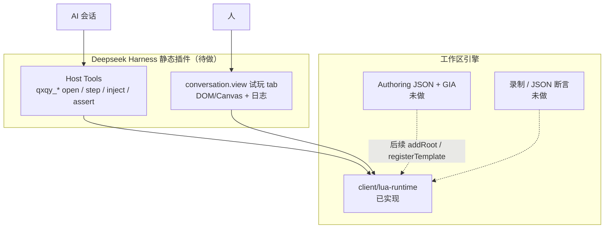
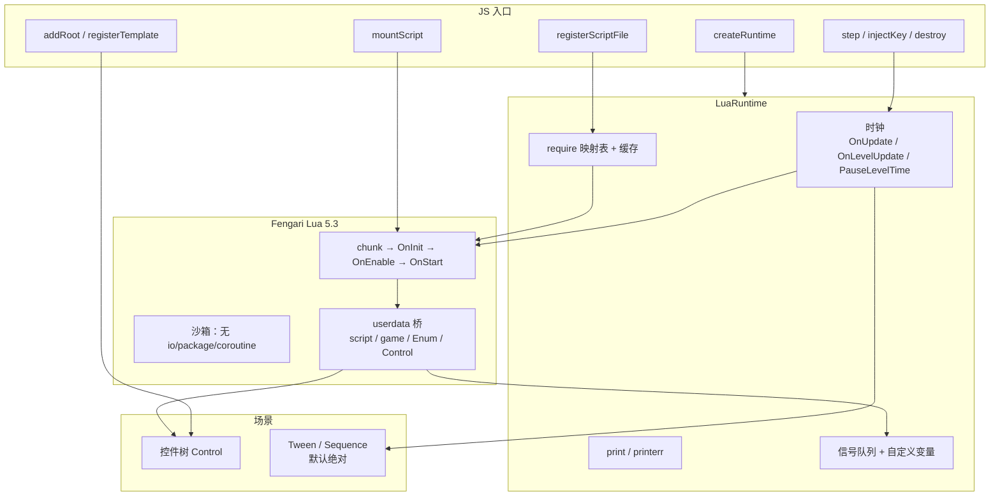
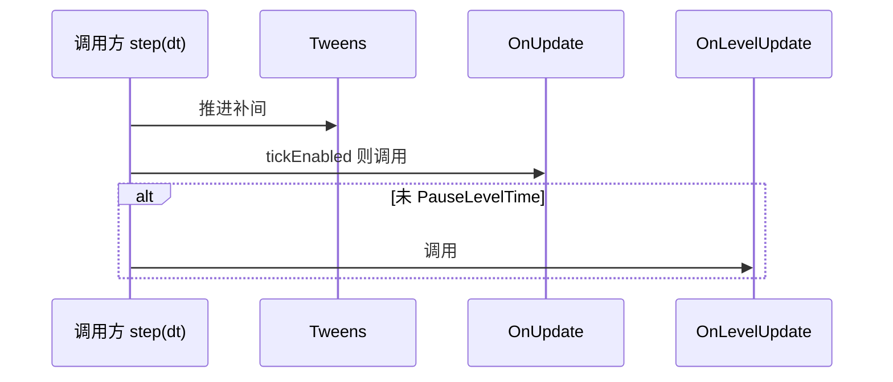
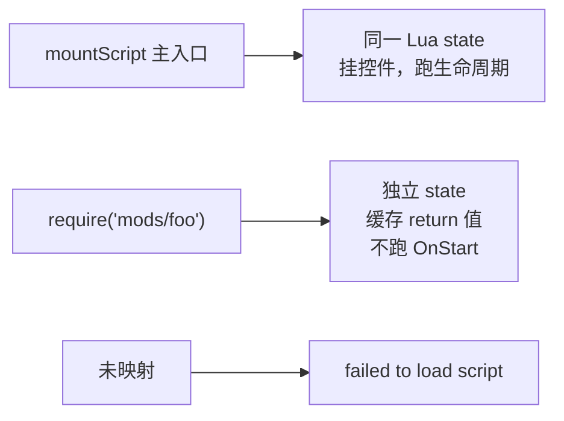

# 架构图

## 1. 产品分层（已锁定）

```mermaid
flowchart TB
  subgraph dsh["Deepseek Harness 静态插件（待做）"]
    Tools["Host Tools<br/>qxqy_* open / step / inject / assert"]
    Tab["conversation.view 试玩 tab<br/>DOM/Canvas + 日志"]
  end

  subgraph engine["工作区引擎"]
    Runtime["client/lua-runtime<br/>已实现"]
    Authoring["Authoring JSON + GIA<br/>未做"]
    Test["录制 / JSON 断言<br/>未做"]
  end

  AI["AI 会话"] --> Tools
  Human["人"] --> Tab
  Tools --> Runtime
  Tab --> Runtime
  Authoring -.->|"后续 addRoot / registerTemplate"| Runtime
  Test -.-> Runtime
```

## 2. Lua 运行时内部（本包）

```mermaid
flowchart TB
  subgraph api["JS 入口"]
    CR["createRuntime"]
    AR["addRoot / registerTemplate"]
    RS["registerScriptFile"]
    MS["mountScript"]
    ST["step / injectKey / destroy"]
  end

  subgraph host["LuaRuntime"]
    Clock["时钟<br/>OnUpdate / OnLevelUpdate / PauseLevelTime"]
    Log["print / printerr"]
    Sig["信号队列 + 自定义变量"]
    Req["require 映射表 + 缓存"]
  end

  subgraph vm["Fengari Lua 5.3"]
    Sandbox["沙箱：无 io/package/coroutine"]
    Bridge["userdata 桥<br/>script / game / Enum / Control"]
    Chunk["chunk → OnInit → OnEnable → OnStart"]
  end

  subgraph scene["场景"]
    Tree["控件树 Control"]
    Tween["Tween / Sequence<br/>默认绝对"]
  end

  CR --> host
  AR --> Tree
  RS --> Req
  MS --> Chunk
  ST --> Clock
  Clock --> Tween
  Clock --> Chunk
  Chunk --> Bridge
  Bridge --> Tree
  Bridge --> Sig
  Req --> Chunk
```

## 3. 一帧顺序

```mermaid
sequenceDiagram
  participant C as 调用方 step(dt)
  participant T as Tweens
  participant U as OnUpdate
  participant L as OnLevelUpdate
  C->>T: 推进补间
  C->>U: tickEnabled 则调用
  alt 未 PauseLevelTime
    C->>L: 调用
  end
```

## 4. 脚本加载

```mermaid
flowchart LR
  A["mountScript 主入口"] --> B["同一 Lua state<br/>挂控件，跑生命周期"]
  C["require('mods/foo')"] --> D["独立 state<br/>缓存 return 值<br/>不跑 OnStart"]
  E["未映射"] --> F["failed to load script"]
```
